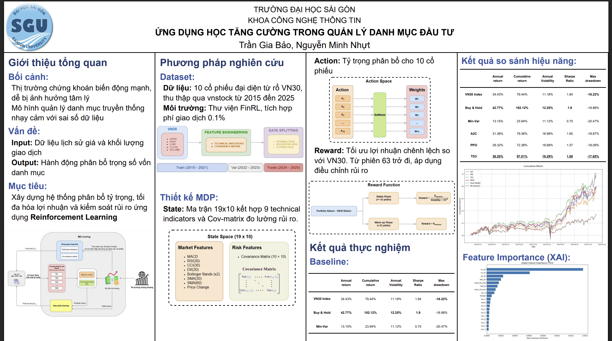

## Report



## Workflow

1. **Train** your models: `python train.py --algo PPO --timesteps 160000 --seed 42`
2. **Validate** performance: `python validate.py --algo PPO --seed 42`  
3. **Backtest** strategy: `python backtest.py --algo PPO --seed 42`
4. **Explain** decisions: `python explain.py --algo PPO --seed 42` (optional)

Or run the complete pipeline: `python run.py --algo PPO --timesteps 160000 --seed 42`

## Structure

- `train.py`: Train RL agents with loss plotting
- `validate.py`: Validate trained models
- `backtest.py`: Backtest models with performance metrics
- `explain.py`: **NEW**: Standalone SHAP explainability analysis
- `run.py`: Complete pipeline runner (train + validate + backtest)
- `example.ipynb`: Basic usage examples
- `multi_seed_training_example.ipynb`: Multi-seed training tutorial
- `agents/`: Agent building
- `env/`: Trading environment
- `data/`: Data loading and preprocessing
- `explainability/`: Legacy SHAP code (now moved to explain.py)
- `utils/`: Utilities like seed setting
- `config/`: Argument parsing
- `results/`: Generated models, logs, metrics, plots, and SHAP analyses
- `results/`: Outputs

## Usage

### Training
```bash
# Single model
python train.py --algo PPO --timesteps 160000 --seed 42

# Multi-seed training
python train.py --algo PPO --timesteps 160000 --seed 42 --n_seeds 5
```

### SHAP Explanation
```bash
python explain.py --algo PPO --seed 42 --n_samples 100
```
python validate.py --algo PPO --seed 42
python backtest.py --algo PPO --seed 42
```

### SHAP Explainability (Standalone)
```bash
python explain.py --algo PPO --seed 42
```

### Full Pipeline (Train + Validate + Backtest)
```bash
python run.py --algo PPO --timesteps 160000 --seed 42 --n_seeds 3
```

## Dependencies

- stable-baselines3
- gym
- pandas
- numpy
- matplotlib
- stockstats
- shap
- finrl

Install with:
```bash
pip install stable-baselines3 gym pandas numpy matplotlib stockstats shap finrl
```
